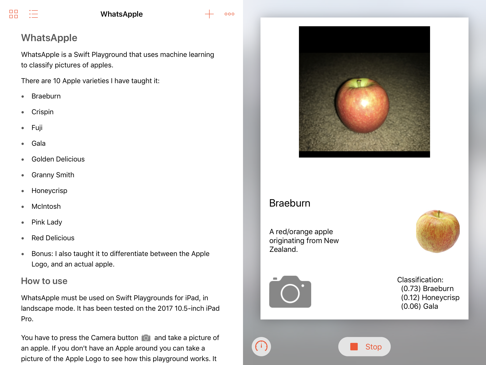

# WhatsApple

 

WhatsApple is a Swift Playground that uses machine learning to classify pictures of apples.

There are 10 Apple varieties I have taught it:

* Braeburn
* Crispin
* Fuji
* Gala
* Golden Delicious
* Granny Smith
* Honeycrisp
* McIntosh
* Pink Lady
* Red Delicious
* Bonus: I also taught it to differentiate between the Apple Logo, and an actual apple.

## How to use

WhatsApple must be used on Swift Playgrounds for iPad. It has been tested on the 2017 10.5-inch iPad Pro, and it works best in landscape mode.

You have to press the Camera button and take a picture of an apple. If you don't have an Apple around you can take a picture of the Apple Logo to see how this playground works. It will also work with a picture of an apple on a screen, but wont be as accurate.

It works most accurately when taking a picture of a single apple, on a white desk. Taking pictures of apples in a group, or with a lot of stuff in the background will still work fine, but wont be as accurate.

## How it works

I am using these technologies: UIKit, Playground Support, AVFoundation, Vision, Core ML, Image I/O and Create ML.

UIKit and Playground Support is used for UI and Playground stuff. AVFoundation is being used to allow interaction with the device camera. Vision and Core ML is used to classify the apples. Image I/O is being used to handle the image orientation. I created the AppleDetector machine learning model on my Macbook using Create ML. I used a total of 235 pictures of Apples, and I integrated this model with Core ML and Vision.

My machine learning model is not super accurate, it has a success rate of 58%. Far better than the average person, but not as good as an Apple expert. It can almost perfectly classify red apples, green apples, golden apples and the Apple logo but it is not as good when classifying the individual red apples. This is mainly due to how similar most red apples look and the difficulty in collecting many pictures of apples. Also note that if you take a picture of a random thing, it will still classify it as an apple even if there is no apple in the picture. This is because it is not trained to classify non-apples.
